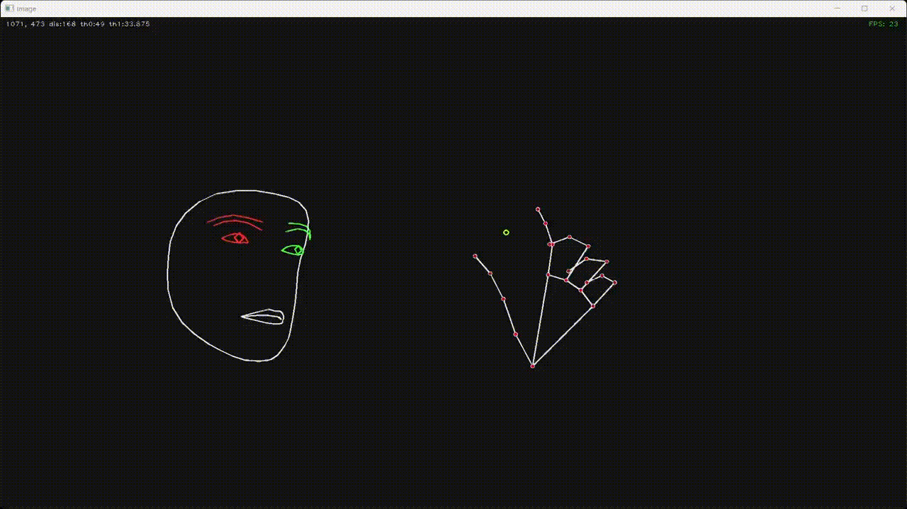

[README in English](readme.md)

## prototype-handtrackについて
open-cvを利用してWEBカメラの映像からハンドトラックを行うプロトタイプソフトです。  
親指と人差し指のホールドでラインを描画、親指と小指のタップでラインをクリアします。  

## 必要なライブラリ
    pip install opencv-python mediapipe

## 利用方法
#### 準備
ソースの以下の部分を利用するWebカメラにあわせて修正してください。  

- WEBCUM_DEVICE_ID  
WEBカメラのデバイスIDを指定。  
仮想カメラなどにも割り振られるので、0から順番に試してください。  
- WEBCUM_WIDTH, WEBCUM_HEIGHT  
WEBカメラの映像サイズを指定。  
FullHDなら1920,1080、HDなら1280,720など利用するWebカメラに合わせて指定してください。  
- WEBCUM_FPS  
WEBカメラのfpsを指定。  
60、30、24など利用するWebカメラに合わせて指定してください。  

#### 実行
    py prototype-handtrack.py

#### キー操作
Q,ESC   : 終了  
R       : ミラー表示のオン/オフ  
H       : 手認識部分の表示（シンプル->詳細->なし->最初に戻る）  
F       : 顔認識部分の表示（シンプル->詳細->なし->目だけ->最初に戻る）  
C       : WEBカメラ映像の表示/非表示  

以上
